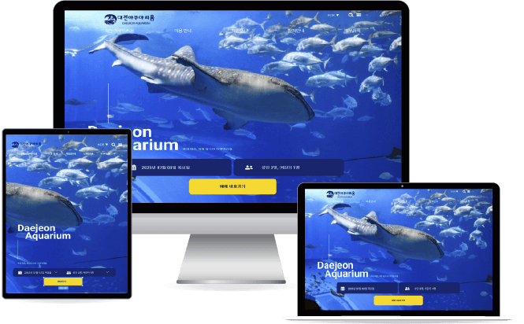
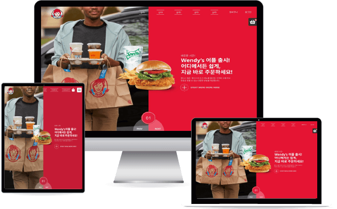

# 2025portfolio
# 👋 About Me
안녕하세요! 저는 웹디자인과 퍼블리싱을 배우고 있는 **임주영**입니다.  
사용자들이 편리한 탐색과 즐거움을 경험 할 수 있는 웹사이트 제작을 목표로 합니다.
기획부터 디자인, 퍼블리싱까지 직접 작업하며 한 단계씩 성장하고 있습니다.  

---

## 💡 Skills

| 분야 | 스킬 |
|-----|------|
| **Design** | Figma, Photoshop, Illustrator |
| **Frontend** | HTML5, CSS3, JavaScript, jQuery |
| **Tools** | VS Code, GitHub, Notion |
| **Etc.** | 반응형 레이아웃, 웹 접근성 고려, Chat GPT, Gemini, Claude |

---

# 💼 Projects

## 1️⃣ Project 01 : 대전 아쿠아리움
> 한 줄 소개 : 대전 아쿠아리움 웹사이트 리뉴얼 

**📆 제작 기간** : 2024.01.01 ~ 2024.01.28  
**🧑 역할** : 디자인100%, 퍼블리싱 100%, 기획 참여

### ⭐ 프로젝트 설명
본 프로젝트는 대전 아쿠아리움의 시설, 동물, 체험 프로그램 소개를 보다 직관적으로 탐색할 수 있도록 제작했습니다. 사용자가 정보를 쉽고 재밌게 확인하면서도 편리하게 예약까지 이어질 수 있도록 설계했습니다.

**주요 특징 키포인트 및 기여**
- 팝업 애니메이션 효과: 층별 안내 섹션의 약도 위에 버튼을 배치하여, 클릭 시 팝업창을 통해 각 층의 정보를 직관적으로 확인할 수 있도록 구현하였습니다.
- 예약 기능 구현: 날짜와 인원을 선택할 수 있는 예약 기능을 추가하였습니다.
- 메인컬러 : Hex code #1C43BE (파란색) / 개방감 & 청량함
- 포인트컬러 : Hex code #FFDA00 (옐로우) 
- **Auto Slide** 자동 슬라이드, **Popup Animation** 팝업 애니메이션, **예약 기능**, **구글 지도 연동** 구현

### 🚀 링크
- [무드보드](https://www.figma.com/proto/kMWgqozWQI4lcNg2hvYMVO/%EB%8C%80%EC%A0%84%EC%95%84%EC%BF%A0%EC%95%84%EB%A6%AC%EC%9B%80_%ED%94%84%EB%A1%9D%EC%A0%9D%ED%8A%B81?node-id=49-2&t=bvm97jlk9zcNeMGC-1&scaling=min-zoom&content-scaling=fixed&page-id=0%3A1)
- [인포메이션 아키텍처](https://www.figma.com/proto/kMWgqozWQI4lcNg2hvYMVO/%EB%8C%80%EC%A0%84%EC%95%84%EC%BF%A0%EC%95%84%EB%A6%AC%EC%9B%80_%ED%94%84%EB%A1%9D%EC%A0%9D%ED%8A%B81?node-id=565-621&p=f&t=DXWcip7CWSdN3Fng-1&scaling=min-zoom&content-scaling=fixed&page-id=565%3A620)
- [와이어 프레임 & 디자인시안](https://www.figma.com/proto/kMWgqozWQI4lcNg2hvYMVO/%EB%8C%80%EC%A0%84%EC%95%84%EC%BF%A0%EC%95%84%EB%A6%AC%EC%9B%80_%ED%94%84%EB%A1%9D%EC%A0%9D%ED%8A%B81?node-id=565-753&p=f&t=LMBNG0ZZAaMi0lTy-1&scaling=min-zoom&content-scaling=fixed&page-id=565%3A752)
- [최종 사이트](https://jooyeonglim.github.io/portfolio2025/project001/)

### 👀 페이지 미리보기
| 메인 | 서브 | |
|-----|------|--|
|  |  |

---

## 2️⃣ Project 02 : 웬디스
> 한 줄 소개 : 식품형 웹사이트 리뉴얼

**📆 제작 기간** : 2025.08.18 ~ 2025.09.05  
**🧑 역할** : 디자인 100%, 퍼블리싱 100%, 기획 100%

### ⭐ 프로젝트 설명
본 프로젝트는 사용자 친화적인 디자인과 직관적인 UI/UX로 리뉴얼하는 것을 목표로 진행했습니다. 방문자가 사이트에 들어왔을 때 원하는 메뉴에 집중할 수 있도록 설계했습니다.

주요 특징 키포인트 및 기여:

- 사용자 중심의 메뉴 배치: 두 번째 섹션에 메뉴를 배치하여 사용자가 사이트 방문 직후 가장 관심 있는 정보를 바로 확인할 수 있도록 구성했습니다.
- 장바구니 기능 구현: 메뉴 선택 후 바로 담을 수 있는 장바구니를 구현하여 구매 과정을 간소화하고, 편리한 쇼핑 경험을 제공합니다.
- 친근한 UI 디자인: 전체적인 색감과 레이아웃, 타이포그래피를 통해 방문자가 편안함과 신뢰감을 느낄 수 있도록 디자인했습니다.

- 메인컬러 : Hex code #e2203d (빨간색) / 친근함 & 식욕자극
- 포인트컬러 : Hex code #199fda (하늘색) / 신뢰감 & 청결
- **Swiper** 슬라이드, **Parallax Scrolling** 패럴랙스 스크롤링, **장바구니**, **로그인 페이지** 구현

### 🚀 링크
- [무드보드](https://www.figma.com/proto/XnjMPmvlNdhkXPTGt1mAdf/%EC%A0%9C%EB%AA%A9-%EC%97%86%EC%9D%8C?node-id=1-5&t=lX1dCrciG2YAF0r5-1&scaling=min-zoom&content-scaling=fixed&page-id=0%3A1)
- [와이어 프레임 & 디자인시안](https://www.figma.com/proto/XnjMPmvlNdhkXPTGt1mAdf/%EC%A0%9C%EB%AA%A9-%EC%97%86%EC%9D%8C?node-id=341-196&p=f&t=QEYpaNRuZwcsPUHX-1&scaling=min-zoom&content-scaling=fixed&page-id=341%3A195)
- [최종 사이트](https://jooyeonglim.github.io/portfolio2025/project002/)
- [코드 저장소](링크)
- [배포 사이트](링크)

### 👀 페이지 미리보기
| 메인 페이지 | 상품 상세 페이지 |
|------------|----------------|
|  |  |

---

## 3️⃣ Project 03 : 프로젝트 제목
> 한 줄 소개 (예: 반응형 포트폴리오 웹사이트 제작)

**📆 제작 기간** : 2024.03.01 ~ 2024.03.15  
**🧑 역할** : 퍼블리싱, 디자인, 기획 전담

### ⭐ 프로젝트 설명
본인 포트폴리오 웹사이트로, 나만의 디자인 스타일을 표현했습니다.  

- **One Page Scroll** 구조
- **GSAP 애니메이션**으로 인터랙션 구현
- **다크모드 토글** 기능 추가

### 🚀 링크
- [무드보드](https://www.figma.com/proto/XnjMPmvlNdhkXPTGt1mAdf/%EC%A0%9C%EB%AA%A9-%EC%97%86%EC%9D%8C?node-id=1-5&t=lX1dCrciG2YAF0r5-1&scaling=min-zoom&content-scaling=fixed&page-id=0%3A1)
- [디자인 시안](링크)
- [GitHub Pages](링크)

### 👀 페이지 미리보기
| 메인 섹션 | 상세 섹션 |
|----------|-----------|
|  |  |

---

## 🎯 배운 점 & 성장 포인트
- HTML/CSS의 시멘틱 마크업과 유지보수성을 고려한 코드 작성법 습득
- 협업을 위한 Git/GitHub 브랜치 관리 경험
- 사용자 경험(UX)을 고려한 디자인 사고 확립
- 문제 해결 능력과 디버깅 스킬 향상
- 직관적인 UX/ UI을 고려한 디자인 설계 능력 향상 UI/UX 설계 능력 향상
- Figma 기반 협업 경험을 통한 커뮤니케이션 능력 습득
- HTML/ CSS/ JavaScript를 활용한 인터랙티브한 웹피이지 구현 경험
